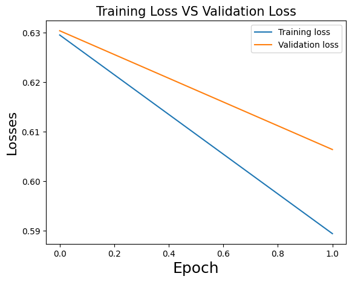
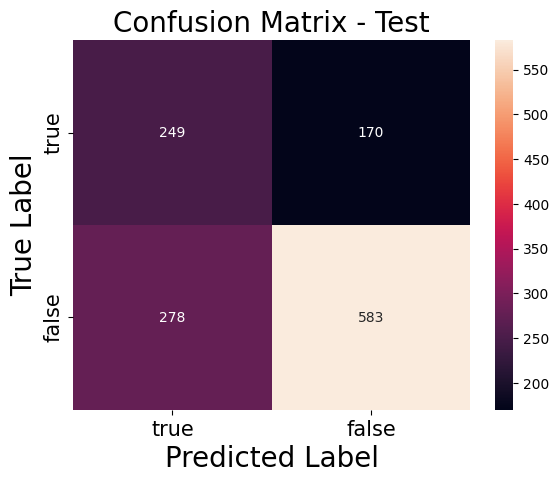

# A BERT-CNN based model trained on the Sentimental LIAR Dataset

The following work flow follows an implementation found in this paper: https://arxiv.org/abs/2009.01047   
and follows the implementation found here: https://github.com/UNHSAILLab/SentimentalLIAR

Ryan Hull, rhull8


```python
# Install the required libraries and dependencies
%pip install -q transformers pandas torch scikit-learn numpy matplotlib sklearn seaborn

# Supress warnings for clean output
import warnings
warnings.filterwarnings('ignore')
```

    Note: you may need to restart the kernel to use updated packages.
    


```python
import pandas as pd

# Import files
df=pd.read_csv("./train_final.csv")
test_df=pd.read_csv("./test_final.csv")
valid_df=pd.read_csv("./valid_final.csv")


# Truncate the data
print("before truncating size of data is :", df.shape, test_df.shape,valid_df.shape)
df=df[:10232]
test_df=test_df[:1264]
valid_df=valid_df[:1280]
print("size of data is :", df.shape, test_df.shape, valid_df.shape)

# Check if there are any null values in the dataframe
print("Any null in Subject? ",df['subject'].isnull().values.any())
print("Any null in Speaker? ",df['speaker'].isnull().values.any())
print("Any null in speaker_job? ",df['speaker_job'].isnull().values.any())
print("Any null in Party? ",df['party_affiliation'].isnull().values.any())
print("Any null in Context? ",df['context'].isnull().values.any())

```

    before truncating size of data is : (10236, 31) (1267, 30) (1283, 31)
    size of data is : (10232, 31) (1264, 30) (1280, 31)
    Any null in Subject?  False
    Any null in Speaker?  False
    Any null in speaker_job?  True
    Any null in Party?  False
    Any null in Context?  True
    


```python
test_df.head()
```


<div>
<style scoped>
    .dataframe tbody tr th:only-of-type {
        vertical-align: middle;
    }

    .dataframe tbody tr th {
        vertical-align: top;
    }

    .dataframe thead th {
        text-align: right;
    }
</style>
<table border="1" class="dataframe">
  <thead>
    <tr style="text-align: right;">
      <th></th>
      <th>Unnamed: 0.2</th>
      <th>Unnamed: 0</th>
      <th>Unnamed: 0.1</th>
      <th>Unnamed: 0.1.1</th>
      <th>Unnamed: 0.1.1.1</th>
      <th>ID</th>
      <th>label</th>
      <th>statement</th>
      <th>subject</th>
      <th>speaker</th>
      <th>...</th>
      <th>anger</th>
      <th>fear</th>
      <th>joy</th>
      <th>disgust</th>
      <th>sad</th>
      <th>speaker_id</th>
      <th>list</th>
      <th>sentiment_code</th>
      <th>comment_text</th>
      <th>emotion</th>
    </tr>
  </thead>
  <tbody>
    <tr>
      <th>0</th>
      <td>0</td>
      <td>0</td>
      <td>0</td>
      <td>0</td>
      <td>0</td>
      <td>11972.json</td>
      <td>true</td>
      <td>Building a wall on the U.S.-Mexico border will...</td>
      <td>immigration</td>
      <td>rick-perry</td>
      <td>...</td>
      <td>0.067151</td>
      <td>0.155968</td>
      <td>0.368879</td>
      <td>0.198711</td>
      <td>0.311238</td>
      <td>_0_</td>
      <td>[1, 0]</td>
      <td>_NEG_</td>
      <td>immigration. Building a wall on the U.S.-Mexic...</td>
      <td>[0.067151, 0.198711, 0.155968, 0.368879, 0.311...</td>
    </tr>
    <tr>
      <th>1</th>
      <td>1</td>
      <td>1</td>
      <td>1</td>
      <td>1</td>
      <td>1</td>
      <td>11685.json</td>
      <td>false</td>
      <td>Wisconsin is on pace to double the number of l...</td>
      <td>jobs</td>
      <td>katrina-shankland</td>
      <td>...</td>
      <td>0.050274</td>
      <td>0.054154</td>
      <td>0.195262</td>
      <td>0.069050</td>
      <td>0.287632</td>
      <td>_1_</td>
      <td>[0, 1]</td>
      <td>NaN</td>
      <td>jobs. Wisconsin is on pace to double the numbe...</td>
      <td>[0.050274, 0.06905, 0.0541539999999999, 0.1952...</td>
    </tr>
    <tr>
      <th>2</th>
      <td>2</td>
      <td>2</td>
      <td>2</td>
      <td>2</td>
      <td>2</td>
      <td>11096.json</td>
      <td>false</td>
      <td>Says John McCain has done nothing to help the ...</td>
      <td>military,veterans,voting-record</td>
      <td>donald-trump</td>
      <td>...</td>
      <td>0.055874</td>
      <td>0.199553</td>
      <td>0.115140</td>
      <td>0.439826</td>
      <td>0.438706</td>
      <td>_2_</td>
      <td>[0, 1]</td>
      <td>_NEG_</td>
      <td>military,veterans,voting-record. Says John McC...</td>
      <td>[0.055874, 0.439826, 0.199553, 0.11514, 0.4387...</td>
    </tr>
    <tr>
      <th>3</th>
      <td>3</td>
      <td>3</td>
      <td>3</td>
      <td>3</td>
      <td>3</td>
      <td>5209.json</td>
      <td>half-true</td>
      <td>Suzanne Bonamici supports a plan that will cut...</td>
      <td>medicare,message-machine-2012,campaign-adverti...</td>
      <td>rob-cornilles</td>
      <td>...</td>
      <td>0.158225</td>
      <td>0.107996</td>
      <td>0.289932</td>
      <td>0.068629</td>
      <td>0.368779</td>
      <td>_3_</td>
      <td>[0, 1]</td>
      <td>NaN</td>
      <td>medicare,message-machine-2012,campaign-adverti...</td>
      <td>[0.158225, 0.068629, 0.107996, 0.289932, 0.368...</td>
    </tr>
    <tr>
      <th>4</th>
      <td>4</td>
      <td>4</td>
      <td>4</td>
      <td>4</td>
      <td>4</td>
      <td>9524.json</td>
      <td>pants-fire</td>
      <td>When asked by a reporter whether hes at the ce...</td>
      <td>campaign-finance,legal-issues,campaign-adverti...</td>
      <td>state-democratic-party-wisconsin</td>
      <td>...</td>
      <td>0.128335</td>
      <td>0.119912</td>
      <td>0.082317</td>
      <td>0.299316</td>
      <td>0.283066</td>
      <td>_4_</td>
      <td>[0, 1]</td>
      <td>_NEG_</td>
      <td>campaign-finance,legal-issues,campaign-adverti...</td>
      <td>[0.128335, 0.2993159999999999, 0.1199119999999...</td>
    </tr>
  </tbody>
</table>
<p>5 rows × 32 columns</p>
</div>


```python
# Initialize the column comment_text
df['comment_text']=""
test_df['comment_text']=""
valid_df["comment_text"]=""

# Combine all the columns into one for for ech dataframe
df['comment_text']=df['subject'].astype(str)+ ". "+ df["statement"]+\
df['speaker_id'].astype(str)+". "+df['speaker_job'].astype(str)+". "+ df['party_affiliation'].astype(str)\
+". "+df['context'].astype(str)+". "+df['sentiment_code'].astype(str)

test_df['comment_text']=test_df['subject'].astype(str)+ ". "+ test_df["statement"]+". "+\
test_df['speaker_id'].astype(str)+". "+test_df['speaker_job'].astype(str)+". "+ test_df['party_affiliation'].astype(str)\
+". "+test_df['context'].astype(str)+". "+df['sentiment_code'].astype(str)

valid_df['comment_text']=valid_df['subject'].astype(str)+ ". "+ valid_df["statement"]+\
valid_df['speaker_id'].astype(str)+". "+valid_df['speaker_job'].astype(str)+". "+ valid_df['party_affiliation'].astype(str)\
+". "+valid_df['context'].astype(str)+". "+valid_df['sentiment_code'].astype(str)

```


```python
#c Concatenate emotion, speakers' credit and sentiment score togehter
df['emotion']="["+df['anger'].astype(str)+","+df['disgust'].astype(str)+","\
+df['fear'].astype(str)+","+df['joy'].astype(str)+","+df['sad'].astype(str)+","+\
df["barely_true_counts"].astype(str) +","+ df["false_counts"].astype(str)  +","+\
df["half_true_counts"].astype(str) + ","+df["mostly_true_counts"].astype(str) +","+ \
df["pants_on_fire_counts"].astype(str)+","+df["sentiment_score"].astype(str)+"]"

test_df['emotion']="["+test_df['anger'].astype(str)+","+test_df['disgust'].astype(str)+","\
+test_df['fear'].astype(str)+","+test_df['joy'].astype(str)+","+test_df['sad'].astype(str)\
+ ","+test_df["barely_true_counts"].astype(str) + ","+ test_df["false_counts"].astype(str) \
+","+ test_df["half_true_counts"].astype(str) +","+ test_df["mostly_true_counts"].astype(str)\
+","+ test_df["pants_on_fire_counts"].astype(str)+","+test_df["sentiment_score"].astype(str)+"]"

valid_df['emotion']="["+valid_df['anger'].astype(str)+","+valid_df['disgust'].astype(str)+","\
+valid_df['fear'].astype(str)+","+valid_df['joy'].astype(str)+","+valid_df['sad'].astype(str)\
+ ","+valid_df["barely_true_counts"].astype(str) + ","+ valid_df["false_counts"].astype(str) \
+","+ valid_df["half_true_counts"].astype(str) +","+ valid_df["mostly_true_counts"].astype(str)\
+","+ valid_df["pants_on_fire_counts"].astype(str)+","+valid_df["sentiment_score"].astype(str)+"]"


```


```python
# Convert the data into a format that is compatible with the model

import ast
def convert_to_list(text):
  return ast.literal_eval(text)

for i in range(len(df["emotion"])):
  try:
    df["emotion"][i]=convert_to_list(df["emotion"][i])
  except:
    print(i,"====",df["emotion"][1])
    
for i in range(len(test_df["emotion"])):
  try:
    test_df["emotion"][i]=convert_to_list(test_df["emotion"][i])
  except:
    print(i,"====",test_df["emotion"][i], type(test_df["emotion"][i]))
    
for i in range(len(valid_df["emotion"])):
  try:
    valid_df["emotion"][i]=convert_to_list(valid_df["emotion"][i])
  except:
    print(i,"====",valid_df["emotion"][i], type(valid_df["emotion"][i]))    
    
df['list']=df['list'].apply(convert_to_list)
test_df['list']=test_df['list'].apply(convert_to_list)
valid_df['list']=valid_df['list'].apply(convert_to_list)
```


```python
# Import the required libraries
import numpy as np
from sklearn import metrics
import transformers
import torch
from torch import cuda
import torch.nn as nn
import torch.nn.functional as F
from torch.utils.data import Dataset, DataLoader, RandomSampler, SequentialSampler
from transformers import BertTokenizer, BertModel, BertConfig

# Use the GPU if available else use the CPU
device = 'cuda' if cuda.is_available() else 'cpu'

# Training Parameters
MAX_LEN = 300
TRAIN_BATCH_SIZE = 8
VALID_BATCH_SIZE = 8
EPOCHS = 1
LEARNING_RATE = 1e-05
tokenizer = BertTokenizer.from_pretrained('bert-base-uncased')
```


```python
# Create a custom dataset class to hold the data in a format that BERT understands
class CustomDataset(Dataset):

    def __init__(self, dataframe, tokenizer, max_len):
        self.tokenizer = tokenizer
        self.data = dataframe
        self.comment_text = dataframe.comment_text
        self.targets = self.data.list
        self.max_len = max_len
        # Add emotion list from dataframe
        self.emotion=dataframe.emotion
        self.dfID=dataframe.ID

    def __len__(self):
        return len(self.comment_text)

    def __getitem__(self, index):
        comment_text = str(self.comment_text[index])
        comment_text = " ".join(comment_text.split())

        inputs = self.tokenizer.encode_plus(
            comment_text,
            None,
            add_special_tokens=True,
            max_length=self.max_len,
            pad_to_max_length=True,
            return_token_type_ids=True,
            truncation=True
        )
        ids = inputs['input_ids']
        mask = inputs['attention_mask']
        token_type_ids = inputs["token_type_ids"]

        return {
            'ids': torch.tensor(ids, dtype=torch.long),
            'mask': torch.tensor(mask, dtype=torch.long),
            'token_type_ids': torch.tensor(token_type_ids, dtype=torch.long),
            'targets': torch.tensor(self.targets[index], dtype=torch.float),
            'emotion':torch.tensor(self.emotion[index], dtype=torch.float),
            'dfID':self.dfID[index]
        }


```


```python
# Create the dataset and dataloader for the neural network

train_size = 1
train_dataset=df.sample(frac=train_size,random_state=200).reset_index(drop=True)
test_dataset=test_df.sample(frac=train_size,random_state=200).reset_index(drop=True)
valid_dataset=valid_df.sample(frac=1,random_state=200).reset_index(drop=True)


print("FULL Dataset: {}".format(df.shape))
print("TRAIN Dataset: {}".format(train_dataset.shape))
print("TEST Dataset: {}".format(test_dataset.shape))
print("VALID Dataset: {}".format(valid_dataset.shape))

training_set = CustomDataset(train_dataset, tokenizer, MAX_LEN)
testing_set = CustomDataset(test_dataset, tokenizer, MAX_LEN)
valid_set= CustomDataset(valid_dataset, tokenizer, MAX_LEN)
train_params = {'batch_size': TRAIN_BATCH_SIZE,
                'shuffle': True,
                'num_workers': 0
                }

test_params = {'batch_size': 8,
                'shuffle': True,
                'num_workers': 0
                }

training_loader = DataLoader(training_set, **train_params)
testing_loader = DataLoader(testing_set, **test_params)
valid_loader=DataLoader(valid_set,**test_params)
```

    FULL Dataset: (10232, 33)
    TRAIN Dataset: (10232, 33)
    TEST Dataset: (1264, 32)
    VALID Dataset: (1280, 33)
    


```python
# Creating the customized model, by adding a drop out and a dense layer on top of BERT-base to get the final output for the model. 
class BERT_cnn_Class(torch.nn.Module):
    def __init__(self):
        super(BERT_cnn_Class, self).__init__()
        self.l1 = transformers.BertModel.from_pretrained('bert-base-uncased')
        self.l2 = torch.nn.Dropout(0.3)
        
        self.l3=torch.nn.Conv1d(1, 50, kernel_size=20,stride=1)
        self.l4=torch.nn.Conv1d(50,100, kernel_size=20, stride=1)
        self.max_pooling=nn.MaxPool1d(2)
        self.l5=torch.nn.Linear(18000, 768)
        self.l6 = torch.nn.Linear(768, 2)
    # Define the forward pass
    def forward(self, ids, mask, token_type_ids,emotion):
        _, output_1= self.l1(ids, attention_mask = mask, token_type_ids = token_type_ids, return_dict=False)
        output_2 = self.l2(output_1) # Output from BERT
        # Feed into convolution network
        # First change the size to [8,1,768]        
        output_2=torch.cat((emotion,output_2),1) # concat the output of BERT with EMO+SPC+SEN (emotion, speakers' credit and sentiment score)
        output_2=output_2.unsqueeze(1)        
        output_3=self.l3(output_2)        
        output_3= self.max_pooling(output_3)
        output_4=self.l4(output_3)        
        output_4=self.max_pooling(output_4)
        # Change the shape to fit into linear function
        output_4=output_4.view(8,-1)
        output_5=self.l5(output_4)
        output_6=self.l6(output_5)        
        return output_6

model = BERT_cnn_Class()

# Put the model on to the GPU if available
model.to(device)
```

    Some weights of the model checkpoint at bert-base-uncased were not used when initializing BertModel: ['cls.seq_relationship.bias', 'cls.predictions.transform.LayerNorm.weight', 'cls.predictions.transform.dense.weight', 'cls.predictions.transform.dense.bias', 'cls.seq_relationship.weight', 'cls.predictions.bias', 'cls.predictions.transform.LayerNorm.bias']
    - This IS expected if you are initializing BertModel from the checkpoint of a model trained on another task or with another architecture (e.g. initializing a BertForSequenceClassification model from a BertForPreTraining model).
    - This IS NOT expected if you are initializing BertModel from the checkpoint of a model that you expect to be exactly identical (initializing a BertForSequenceClassification model from a BertForSequenceClassification model).
    


    BERT_cnn_Class(
      (l1): BertModel(
        (embeddings): BertEmbeddings(
          (word_embeddings): Embedding(30522, 768, padding_idx=0)
          (position_embeddings): Embedding(512, 768)
          (token_type_embeddings): Embedding(2, 768)
          (LayerNorm): LayerNorm((768,), eps=1e-12, elementwise_affine=True)
          (dropout): Dropout(p=0.1, inplace=False)
        )
        (encoder): BertEncoder(
          (layer): ModuleList(
            (0-11): 12 x BertLayer(
              (attention): BertAttention(
                (self): BertSelfAttention(
                  (query): Linear(in_features=768, out_features=768, bias=True)
                  (key): Linear(in_features=768, out_features=768, bias=True)
                  (value): Linear(in_features=768, out_features=768, bias=True)
                  (dropout): Dropout(p=0.1, inplace=False)
                )
                (output): BertSelfOutput(
                  (dense): Linear(in_features=768, out_features=768, bias=True)
                  (LayerNorm): LayerNorm((768,), eps=1e-12, elementwise_affine=True)
                  (dropout): Dropout(p=0.1, inplace=False)
                )
              )
              (intermediate): BertIntermediate(
                (dense): Linear(in_features=768, out_features=3072, bias=True)
                (intermediate_act_fn): GELUActivation()
              )
              (output): BertOutput(
                (dense): Linear(in_features=3072, out_features=768, bias=True)
                (LayerNorm): LayerNorm((768,), eps=1e-12, elementwise_affine=True)
                (dropout): Dropout(p=0.1, inplace=False)
              )
            )
          )
        )
        (pooler): BertPooler(
          (dense): Linear(in_features=768, out_features=768, bias=True)
          (activation): Tanh()
        )
      )
      (l2): Dropout(p=0.3, inplace=False)
      (l3): Conv1d(1, 50, kernel_size=(20,), stride=(1,))
      (l4): Conv1d(50, 100, kernel_size=(20,), stride=(1,))
      (max_pooling): MaxPool1d(kernel_size=2, stride=2, padding=0, dilation=1, ceil_mode=False)
      (l5): Linear(in_features=18000, out_features=768, bias=True)
      (l6): Linear(in_features=768, out_features=2, bias=True)
    )


```python
import time
import datetime
def format_time(elapsed):
    elapsed_rounded = int(round((elapsed)))    
    return str(datetime.timedelta(seconds=elapsed_rounded))
```


```python
# Loss function (BCE) and Optimizer (Adam)
def loss_fn(outputs, targets):
    return torch.nn.BCEWithLogitsLoss()(outputs, targets)
optimizer = torch.optim.Adam(params =  model.parameters(), lr=LEARNING_RATE)
```


```python
#TRAIN
val_losses=[]
train_losses=[]
accuracy_list=[]

for epoch in range(2):
  t0 = time.time()
  model.train()
  print(f"Epoch: {epoch + 1}  is Started: ")
  batch=0
  train_loss=0
  
  for _,data in enumerate(training_loader, 0):
      try:
          ids = data['ids'].to(device, dtype = torch.long)
          mask = data['mask'].to(device, dtype = torch.long)
          token_type_ids = data['token_type_ids'].to(device, dtype = torch.long)
          targets = data['targets'].to(device, dtype = torch.float)
          emotions=data['emotion'].to(device,dtype=torch.float)
      except:
          print(f"some error at testing {batch}")
          print(data['dfID'] )
      try:  
        outputs = model(ids, mask, token_type_ids,emotions)
        optimizer.zero_grad()
        loss = loss_fn(outputs, targets)
        train_loss+=loss.item()
        optimizer.zero_grad()
        loss.backward()
        optimizer.step()
        batch+=1
      except EOFError:
        print(f"{data['dfID']} error because of batch size-------->", EOFError)
        print(f"some error at testing {batch}")
        print(data['dfID'] )
      torch.cuda.empty_cache()
  print(f"Epoch: {epoch + 1} Train loss is :{train_loss/batch}") 
  train_loss /=batch
  train_losses.append(train_loss)    
  print(f"Epoch {epoch + 1} took: {format_time(time.time() - t0)} \n")

  model.eval()
  fin_targets=[]
  fin_outputs=[]
  with torch.no_grad():
      val_loss, batch = 0, 1
      for _, data in enumerate(testing_loader, 0):
          ids = data['ids'].to(device, dtype = torch.long)
          mask = data['mask'].to(device, dtype = torch.long)
          token_type_ids = data['token_type_ids'].to(device, dtype = torch.long)
          targets = data['targets'].to(device, dtype = torch.float)
          emotions=data['emotion'].to(device,dtype=torch.float)
          batch+=1
          try:
                        outputs = model(ids, mask, token_type_ids,emotions)
                        loss = loss_fn(outputs, targets)
                        val_loss+=loss.item()
                        fin_targets.extend(targets.cpu().detach().numpy().tolist())
                        fin_outputs.extend(torch.sigmoid(outputs).cpu().detach().numpy().tolist())
          except:
            print(f"some error at testing {batch}")
            print(data['dfID'] )
          torch.cuda.empty_cache()

      val_loss/=batch
      val_losses.append(val_loss)
  outputs=fin_outputs
  outputs = np.array(outputs) >= 0.5
  targets=fin_targets
  accuracy = metrics.accuracy_score(targets, outputs)
  accuracy_list.append(accuracy)
  f1_score_micro = metrics.f1_score(targets, outputs, average='micro')
  f1_score_macro = metrics.f1_score(targets, outputs, average='macro')
  print(f"Epoch: {epoch + 1} - Accuracy on Testing Data Score = {accuracy}")
  print(f"Epoch: {epoch + 1} - F1 Score on Testing Data (Micro) = {f1_score_micro}")
  print(f"Epoch: {epoch + 1} - F1 Score on Testing Data (Macro) = {f1_score_macro}")
  print(f"\nEpoch {epoch + 1} : Train Loss (Training Data):{train_loss}, Validation Loss (Testing Data): {val_loss}")
  print("_________________________________________________\n")
  
```

    Epoch: 1  is Started: 
    Epoch: 1 Train loss is :0.6295657322171893
    Epoch 1 took: 0:04:57 
    
    Epoch: 1 - Accuracy on Testing Data Score = 0.6661392405063291
    Epoch: 1 - F1 Score on Testing Data (Micro) = 0.6661392405063291
    Epoch: 1 - F1 Score on Testing Data (Macro) = 0.5301595354867805
    
    Epoch 1 : Train Loss (Training Data):0.6295657322171893, Validation Loss (Testing Data): 0.6304245248155774
    _________________________________________________
    
    Epoch: 2  is Started: 
    Epoch: 2 Train loss is :0.5894109049493023
    Epoch 2 took: 0:04:55 
    
    Epoch: 2 - Accuracy on Testing Data Score = 0.6708860759493671
    Epoch: 2 - F1 Score on Testing Data (Micro) = 0.6716772151898734
    Epoch: 2 - F1 Score on Testing Data (Macro) = 0.6579745410895443
    
    Epoch 2 : Train Loss (Training Data):0.5894109049493023, Validation Loss (Testing Data): 0.6064159298467936
    _________________________________________________
    
    


```python
from pandas import DataFrame
df=DataFrame(train_losses,columns=['train_losses'])
df=DataFrame(val_losses,columns=['val_losses'])
df.to_csv("./results.csv")

```


```python


import matplotlib.pyplot as plt
plt.plot(train_losses, label="Training loss")
plt.plot(val_losses, label="Validation loss")

plt.xlabel('Epoch', fontsize=18)
plt.ylabel('Losses', fontsize=16)
plt.title('Training Loss VS Validation Loss', fontsize=15)

plt.legend()
plt.savefig('./results/epoch1.eps')
```

    The PostScript backend does not support transparency; partially transparent artists will be rendered opaque.
    


    

    


```python
# Test on the validation dataset
model.eval()
fin_targets=[]
fin_outputs=[]

with torch.no_grad():
    c=0
    for _, data in enumerate(valid_loader, 0):
        ids = data['ids'].to(device, dtype = torch.long)
        mask = data['mask'].to(device, dtype = torch.long)
        token_type_ids = data['token_type_ids'].to(device, dtype = torch.long)
        targets = data['targets'].to(device, dtype = torch.float)
        emotions=data['emotion'].to(device,dtype=torch.float)
        c+=1
        try:
                      outputs = model(ids, mask, token_type_ids,emotions)
                      fin_targets.extend(targets.cpu().detach().numpy().tolist())
                      fin_outputs.extend(torch.sigmoid(outputs).cpu().detach().numpy().tolist())
        except EOFError:
          print(f"some error at {c}",EOFError)
outputs = fin_outputs
outputs = np.array(outputs) >= 0.5
targets = fin_targets
accuracy = metrics.accuracy_score(targets, outputs)

f1_score_macro = metrics.f1_score(targets, outputs, average='macro')
print(f"Epoch:  {epoch + 1}, Accuracy Score on validation data = {accuracy}")

print(f"Epoch:  {epoch + 1}, F1 Score on Validation Data (Macro) = {f1_score_macro}")
```

    Epoch:  2, Accuracy Score on validation data = 0.65
    Epoch:  2, F1 Score on Validation Data (Macro) = 0.6253810935614209
    


```python
from sklearn.metrics import confusion_matrix
import seaborn as sns

cm = confusion_matrix(np.array(targets).argmax(axis=1), outputs.argmax(axis=1))
ax = plt.subplot()
sns.heatmap(cm, annot=True, ax = ax, fmt = 'g'); #annot=True to annotate cells
# labels, title and ticks
ax.set_title('Confusion Matrix - Test', fontsize=20)
ax.set_xlabel('Predicted Label', fontsize=20)
ax.xaxis.set_label_position('bottom') 
ax.xaxis.set_ticklabels(['true', 'false'], fontsize = 15)
ax.xaxis.tick_bottom()

ax.set_ylabel('True Label', fontsize=20)
ax.yaxis.set_ticklabels(['true', 'false'], fontsize = 15)
plt.show()

```


    

    

